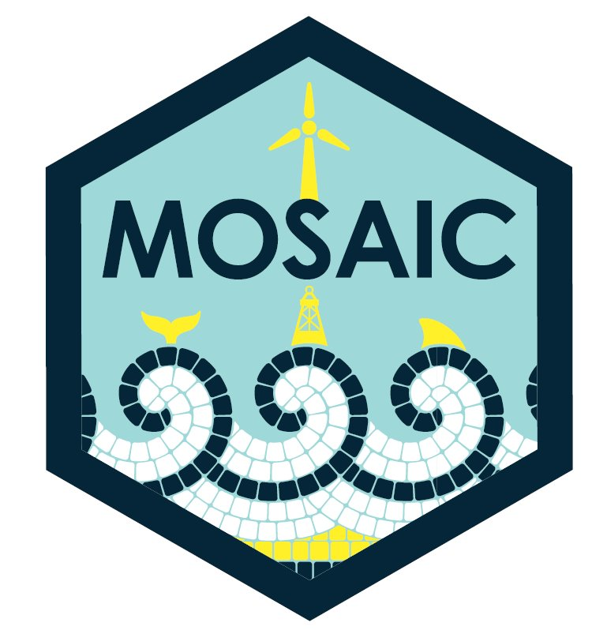

As a postdoctoral researcher within **MOSAIC (Multi-disciplinary Ocean Sensing for Adaptive International Conservation)**, I lead the project's **stable isotope workflow**, using biochemical tracers to investigate mesopelagic food-web structure in the North East Atlantic.

My work focuses on understanding how energy moves through these deep-water food webs and how different organisms are connected within the wider marine ecosystem. I work across the workflow from sample processing and stable isotope analysis through to interpreting the resulting data in an ecological context.

This work forms part of MOSAIC's wider effort to bring together complementary approaches to better understand marine ecosystems and generate evidence to support their monitoring, conservation and management.

As the project progresses, I'll share updates and insights from my work here.

